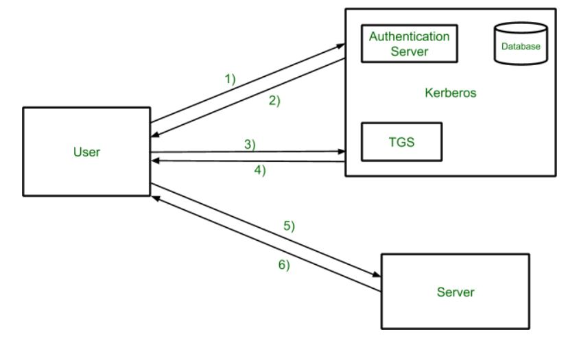

## **Active Directory - Microsoft/Azure**
Kerberos is an authentication protocol for trusted hosts on untrusted networks

### Key Terminologies
- **Active Directory** - AD is a database and set of services that connect users with the network resources. The database (or directory) contains critical information about your environment, including what users and computers there are and who's allowed to do what. An AD manages your identity and gives secure access
- **Domain Controllers** - A domain controller is a type of server that processes requests for authentication
- **Domain** - a collection of objects within an Active Directory network
- **Realm** - Authentication Administrative domain
- **Cross authentication** -  if the two objects are part of different realms and there is a trust relationship between them, then the authentication can take place
- **Principal** - A principal is the name used to refer to the entries in the authentication server database. A principal is associated with each user, host or service of a given realm. Ex: Each user and service on the network is a principal
- **KDC** - Key Distribution Center
- **AS** - Authentication Server
- **TGT** - Ticket Granting Ticket
- **TGS** - Ticket Granting Server
- **Ticket** - A ticket is something a client presents to an application server to demonstrate the authenticity of its identity
- **Kerberoasting** - Kerberoasting is a technique used to request service tickets for service accounts that are configured to use service principal names (SPNs). Does not depend on whether pre-authentication is enabled.
- **AS-REP Roasting** - ASReproasting (Kerberos Authentication Service Response roasting) occurs when a user account has the privilege "Does not require Pre-Authentication" set. This means that the account does not need to provide valid identification before requesting a Kerberos Ticket on the specified user account. Only works if pre-authentication is disabled for a user.
- **DRSUAPI** - Directory Replication Service Remote Protocol - used bu impacket-secretsdump to dump all the password hashes of the users
- **Silver/Golden Tickets** - Explained in detail below

 

 

### **Working**
**Step 1:** 
User login and request services on the host. Thus user requests for ticket-granting service. 

**Step 2:** 
Authentication Server verifies user’s access right using database and then gives ticket-granting-ticket and session key. Results are encrypted using the Password of the user. 
    
**Step 3:**
The decryption of the message is done using the password then send the ticket to Ticket Granting Server. The Ticket contains authenticators like user names and network addresses. 
    
**Step 4:**
Ticket Granting Server decrypts the ticket sent by User and authenticator verifies the request then creates the ticket for requesting services from the Server. 
    
**Step 5:** 
The user sends the Ticket and Authenticator to the Server. 
    
**Step 6:** 
The server verifies the Ticket and authenticators then generate access to the service. After this User can access the services. 

#### Kerberos Limitations
- Each network service must be modified individually  for use with Kerberos
- It doesn’t work well in a timeshare environment
- Secured Kerberos Server
- Requires an always-on Kerberos server
- Stores all passwords are encrypted with a single key
- Assumes workstations are secure
- May result in cascading loss of trust.
- Scalability

#### Silver/Golden Tickets

### References:
- [https://www.kerberos.org/software/tutorial.html](https://www.kerberos.org/software/tutorial.html)
- [https://www.geeksforgeeks.org/kerberos/](https://www.geeksforgeeks.org/kerberos/)
- [https://tryhackme.com/r/room/attacktivedirectory](https://tryhackme.com/r/room/attacktivedirectory)
- [https://en.hackndo.com/kerberos-silver-golden-tickets/#silver-ticket](https://en.hackndo.com/kerberos-silver-golden-tickets/#silver-ticket)